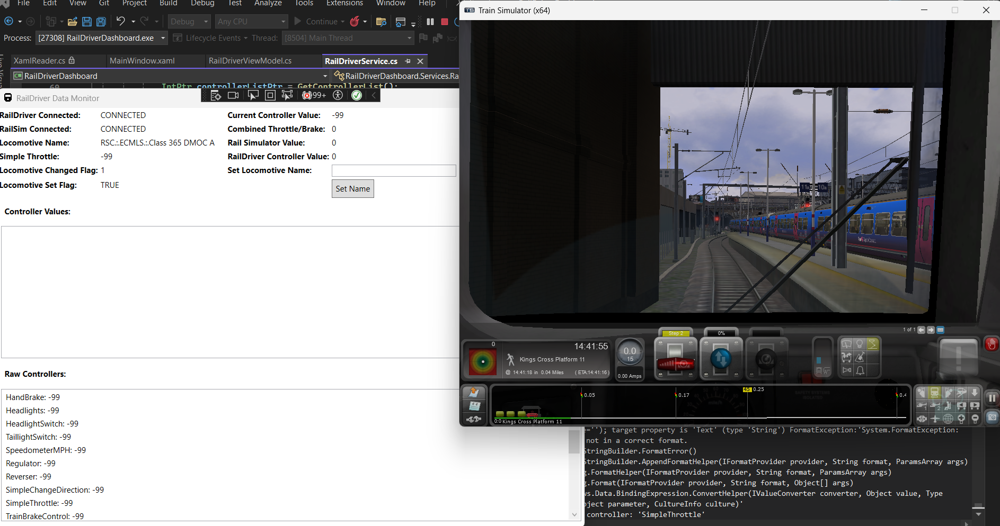
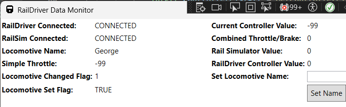
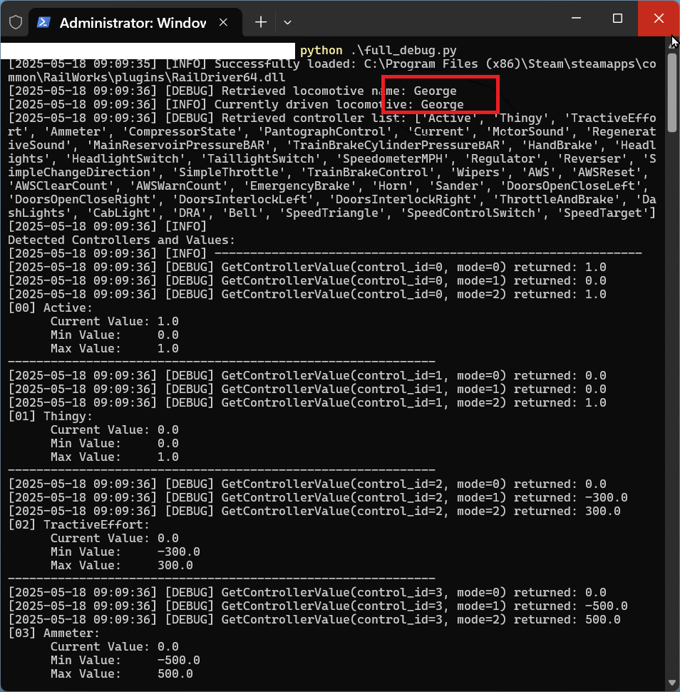

# 🚂 RailDriver of Train Simulator Classic 🎮

**This is a work in progress 🛤️**

This project is a first approach to the world of train simulation, specifically focusing on the integration between the RailDriver hardware controller and Train Simulator Classic (TSC). Our goal? To establish a robust communication channel that allows for both reading and controlling virtual locomotive functions. Buckle up, and let's explore the challenges and discoveries in this exciting endeavor!

## GUI and Python Script screenshots










## 🌟 Project Highlights

* Direct interaction with the RailDriver DLL (No TSConductor).
* Python-based debugging and automation.
* In-depth analysis of communication challenges.
* Open-source exploration for the TSC community.

## 🛠️ Installation & Setup

### Prerequisites

* **Train Simulator Classic:** Ensure you have TSC installed. All testing was done with 2024 version.
* **RailDriver.dll:** Both DLL versions were installed in the game, no need for hardware controller.
* **Python 3.x:** Python3 is used for the debugging script. Download it [here](https://www.python.org/downloads/).
* **`keyboard` Library:** Install this library for keyboard input handling:
    ```bash
    pip install keyboard
    ```

###   Important Architecture Note ⚠️

* For 64-bit systems and 64-bit Python, the **64-bit version of the RailDriver DLL (`RailDriver64.dll`)** is required.

###   DLL Location

* The RailDriver DLL is usually found within the Train Simulator Classic installation folder:
    ```
    C:\Program Files (x86)\Steam\steamapps\common\RailWorks\plugins\RailDriver64.dll
    ```
    (The drive letter might vary depending on your system.)

## ⚙️ Project Structure

├── docs/│   └── banner.png      # Project banner image├── raildriver_debug.py # Python debugging script└── README.md         # This file
## 👨‍💻 Code Walkthrough: `raildriver_debug.py`

The `raildriver_debug.py` script is a Python-based tool designed to interact with the RailDriver DLL. Here's a breakdown:

1.  **Import Libraries:**
    ```python
    import os
    import ctypes
    import time
    import keyboard
    from ctypes import c_int, c_char_p, c_float, POINTER, create_string_buffer
    ```
2.  **DLL Loading:**
    ```python
    DLL_PATH = os.path.join(os.getcwd(), "C:\Program Files (x86)\Steam\steamapps\common\RailWorks\plugins\RailDriver64.dll")
    try:
        rd_dll = ctypes.CDLL(DLL_PATH)
        print(f"Loaded DLL: {DLL_PATH}")
    except OSError as e:
        print(f"Failed to load DLL: {e}")
        exit(1)
    ```
    * Specifies the path to the RailDriver DLL.
    * Loads the DLL using `ctypes.CDLL`.
    * Handles potential errors during DLL loading.
3.  **Function Definitions:**
    ```python
    rd_dll.SetRailDriverConnected.argtypes = [c_int]
    rd_dll.SetRailDriverConnected.restype = None
    # ... other function definitions ...
    ```
    * Defines the argument and return types for the DLL functions we intend to use. This is crucial for correct data handling.
4.  **Connect to RailDriver:**
    ```python
    try:
        rd_dll.SetRailDriverConnected(1)
        print("Connected to RailDriver.")
    except Exception as e:
        print(f"Error connecting to RailDriver: {e}")
    ```
    * Calls the `SetRailDriverConnected` function to establish a connection.
5.  **Main Loop:**
    ```python
    headlights_on = False
    wipers_on = False
    try:
        while True:
            # ... logic for reading and setting values ...
            time.sleep(1)
    except KeyboardInterrupt:
        print("\nExiting loop.")
    except Exception as e:
        print(f"\nAn error occurred: {e}")
    finally:
        pass
    ```
    * Enters a loop to continuously read controller values, set values based on keyboard input, and display information.
    * Handles keyboard interrupts (Ctrl+C) for graceful exit.
    * Includes a `finally` block for any necessary cleanup (currently empty, but good practice).
6.  **Controller Interaction (Inside Loop):**
    ```python
     if keyboard.is_pressed('l'):
        headlights_on = not headlights_on
        try:
            rd_dll.SetControllerValue(b"Headlights", 1.0 if headlights_on else 0.0)
            time.sleep(0.2)
        except Exception as e:
            print(f"  Error setting headlights: {e}")

    if keyboard.is_pressed('w'):
        wipers_on = not wipers_on
        try:
            rd_dll.SetControllerValue(b"Wipers", 1.0 if wipers_on else 0.0)
            time.sleep(0.2)
        except Exception as e:
            print(f"  Error setting wipers: {e}")

    # Get and print the current values
    try:
        headlights_value = rd_dll.GetControllerValue(b"Headlights")
        wipers_value = rd_dll.GetControllerValue(b"Wipers")
        print(f"  Headlights Value: {headlights_value} (Target: {'On' if headlights_on else 'Off'})")
        print(f"  Wipers Value: {wipers_value} (Target: {'On' if wipers_on else 'Off'})")
    except Exception as e:
        print(f"  Error getting light/wiper values: {e}")
    ```
    * Uses the `keyboard` library to detect key presses ('l' for lights, 'w' for wipers).
    * Toggles the state of the headlights/wipers and attempts to set the corresponding controller values using `rd_dll.SetControllerValue`.
    * Reads the current values using  `rd_dll.GetControllerValue` and prints them to the console.

## ⚠️ Challenges & Lessons Learned

Connecting RailDriver to Train Simulator Classic wasn't a smooth ride. Issues below:

###   DLL Compatibility is Key 🔑

* For 64-bit systems and Python, the **64-bit RailDriver DLL (`RailDriver64.dll`)** is essential. PYthon will not work with the 32-bit version on a 64-bit OS.

###   Value Retrieval Inconsistencies ❓

* Still an open topic is the consistent return of `-99.0` for many controller values. This indicates that the DLL is not providing active state information for those controllers. The reasons for this are still under investigation. Furthermore the set values are not returngina an error, and yet they dont work (for example, engage the brakes)

###   Setting Values, Unclear Response 🤷

* While the call to `SetControllerValue` returns no errors, the corresponding actions (like braking or toggling switches) weren't reliably reflected in the game. This suggests a potential disconnect in how the DLL communicates with the TSC game engine.

## 🤔 Open Questions & Future Directions

Right now, the focus is on the topics below:

* **Root Cause of `-99.0`:** Determining why many controller values return `-99.0` is crucial. Is it a locomotive-specific issue? A configuration problem?
* **Improving `SetControllerValue`:** Investigating the proper way to send commands to TSC via the DLL is essential for achieving control over the simulation.
* **Expanding Controller Support:** Extending the script to handle a wider range of locomotive controls.
* **Community Collaboration:** Engaging with the Train Simulator Classic and RailDriver communities to share findings and seek solutions.

## 📄 Disclaimer

This project is an independent work created for fun and is a work in progress. It is not affiliated with, endorsed by, or connected in any way to the developers or publishers of the game, the manufacturers of the hardware utilizing RailDriver.dll, or any related organizations. The code is provided as-is, without warranty of any kind. The creator assumes no responsibility for any issues, damages, or consequences resulting from its use.

## 🤝 Contribution

Contributions are welcome! If you have experience with Train Simulator Classic, RailDriver, or DLL interaction, feel free to:

* Fork this repository.
* Submit pull requests with improvements or bug fixes.
* Open issues to report problems or suggest new features.
* Share your findings and insights.

## 📄 License

[MIT License](LICENSE)

## 🙏 Acknowledgements

* Thanks to the communities of Train Simulator Classic and RailDriver for their valuable information and resources.
* A special thanks to the initial explorers who attempted this integration, there are several documents describing the interfacing with RailDriver.dll out there.

 
